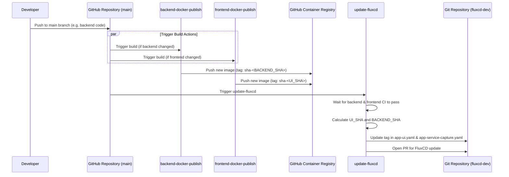

# GitHub Actions Workflows

This directory contains the continuous integration and continuous delivery (CI/CD) workflows for the `service-capture` project.

## Workflows Summary

| Workflow | Description | Triggers |
|---|---|---|
| **frontend-docker-publish** | Builds and publishes the frontend Docker image to GitHub Container Registry (GHCR). Creates multi-arch images. | Push to `main`, PRs to `main` (paths: `frontend/**`, `.github/workflows/frontend-docker-publish.yml`) |
| **backend-docker-publish** | Builds and publishes the backend Docker image to GHCR. Creates multi-arch images. | Push to `main`, PRs to `main` (paths: `backend/**`, `.github/workflows/backend-docker-publish.yml`) |
| **update-fluxcd** | Updates the image tags in the `fluxcd-dev` environment configuration and automates GitOps. Waits for the docker publish workflows, calculates the image tags using Git SHAs, updates `app-ui.yaml` and `app-service-capture.yaml`, and opens a PR with the changes. | Push to `main` |
| **helm-publish / helm-release** | Packages and publishes Helm charts to the repository for deployment. | Release creation or branch triggers |
| **frontend-release / backend-release** | Coordinates standard release routines for the frontend and backend applications when creating tags. | Release creation |

## CI/CD GitOps Flow

The following Mermaid diagram illustrates the automatic deployment flow used when a developer pushes changes to the `main` branch.

