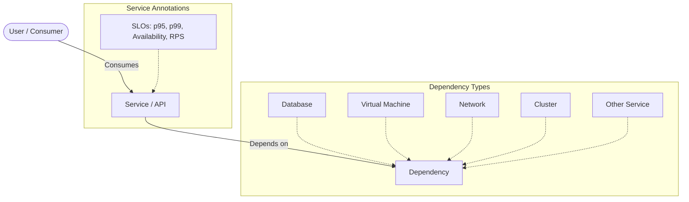
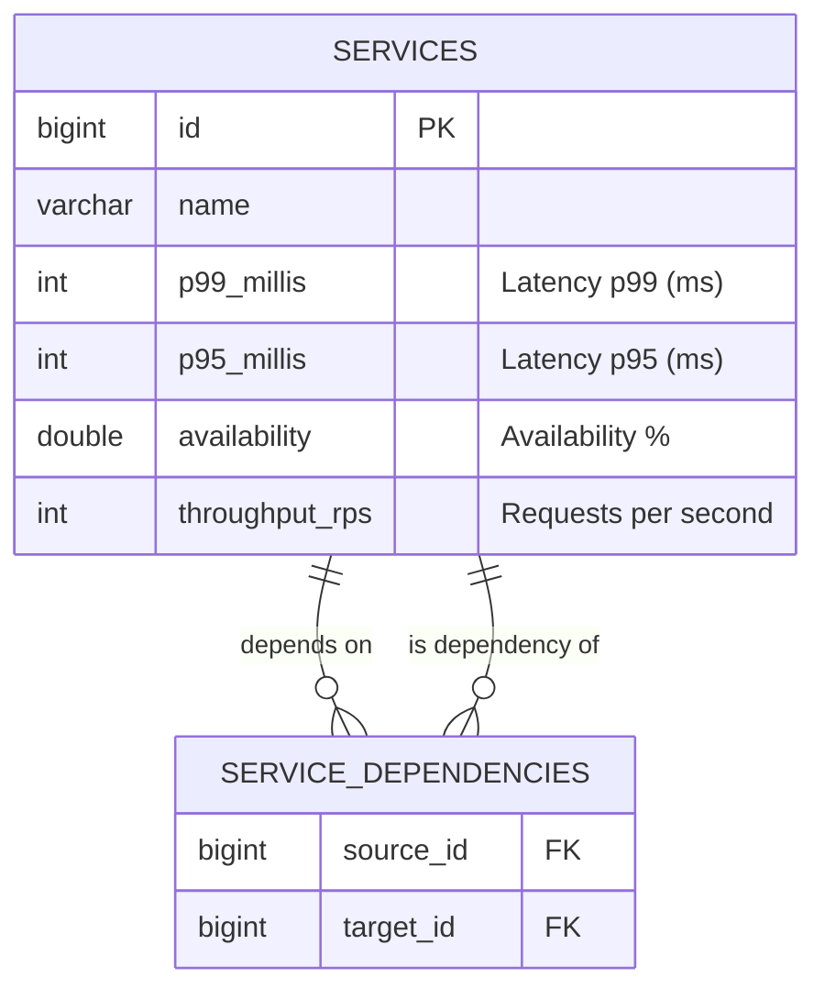

# Service Capture

* [](https://github.com/PolecatWorks/service-capture/actions/workflows/backend-docker-publish.yml)
* [](https://github.com/PolecatWorks/service-capture/actions/workflows/frontend-docker-publish.yml)
* [](https://github.com/PolecatWorks/service-capture/actions/workflows/helm-publish.yaml)

This application is designed to capture, visualize, and annotate the dependencies of services and API calls required to implement customer journeys.

It allows users to define **Services** (API services and their consumers) and map out their **Dependencies** on other services or infrastructure components such as:
*   Databases
*   Virtual Machines
*   Networks
*   Clusters

Furthermore, services can be annotated with Service Level Objectives (SLOs) and Service Level Indicators (SLIs) like **p95**, **p99**, **availability**, and **throughput**, enabling risk identification and resiliency planning.

## Conceptual Overview



## Architecture

The application is composed of a Rust backend and an Angular frontend, persisting data to a PostgreSQL database.

```mermaid
graph TD
    User[User / Browser] -->|HTTPS| FE[Frontend (Angular)]
    FE -->|JSON/HTTPS| BE[Backend (Rust / Axum)]
    BE -->|SQL/TCP| DB[(Postgres Database)]

    subgraph "Kubernetes / Docker Environment"
        FE
        BE
        DB
    end
```

### Tech Stack

**Backend**
*   **Language:** Rust
*   **Framework:** Axum
*   **Database Interface:** sqlx
*   **Runtime:** Tokio

**Persistence**
*   **Database:** PostgreSQL

**Frontend**
*   **Framework:** Angular
*   **UI Library:** Angular Material

## Database Schema

The core data model consists of `services` and their `service_dependencies`.



## Getting Started

### Prerequisites

Ensure you have the following installed on your development machine:
*   **Make**: To run the build targets.
*   **Docker**: For running the database and containerized builds.
*   **Rust & Cargo**: For backend development (ensure `cargo-watch` is installed: `cargo install cargo-watch`).
*   **Node.js & NPM**: For frontend development.
*   **Angular CLI**: (`npm install -g @angular/cli`).

### Development Setup & Run

The project uses a `Makefile` to streamline development tasks.

1.  **Start the Database:**
    Starts a local Postgres instance in Docker.
    ```bash
    make db-local
    ```

2.  **Run the Backend:**
    Runs the Rust backend with hot-reloading enabled.
    ```bash
    make backend-dev
    ```
    *Note: The backend runs on port 8080 by default.*

3.  **Run the Frontend:**
    Runs the Angular frontend.
    ```bash
    make frontend-dev
    ```
    *Note: The frontend runs on port 4200 by default.*

### Other Make Targets

*   `make backend-test`: Run backend tests.
*   `make backend-docker`: Build the backend Docker image.
*   `make frontend-docker`: Build the frontend Docker image.

## Authentication

The application uses OpenID Connect (OIDC). Below is an example of interacting with a Keycloak instance (if running in a Kubernetes environment or similar setup).

**Get OIDC Configuration:**
```bash
curl http://keycloak.k8s/auth/realms/dev/.well-known/openid-configuration
```

**Obtain a JWT (Example):**
```bash
curl -X POST http://keycloak.k8s/auth/realms/dev/protocol/openid-connect/token \
-H "Content-Type: application/x-www-form-urlencoded" \
-d "grant_type=password" \
-d "username=johnsnow" \
-d "password=johnsnow" \
-d "client_id=app-ui"
```

### Python Auth Example
```python
import aiohttp

async def get_jwt_token():
    url = "http://keycloak.k8s/auth/realms/dev/protocol/openid-connect/token"
    data = {
        "grant_type": "password",
        "username": "johnsnow",
        "password": "johnsnow",
        "client_id": "app-ui"
    }
    async with aiohttp.ClientSession() as session:
        async with session.post(url, data=data) as response:
            return await response.json()
```

## End-to-End Testing

To run the Python-based integration tests located in `tests/`:

1.  **Install Dependencies:**
    ```bash
    cd tests
    python3 -m venv venv
    source venv/bin/activate
    pip install poetry
    poetry install --with dev
    ```

2.  **Run Tests:**
    (Refer to the documentation inside `tests/` or run `pytest` if applicable).
