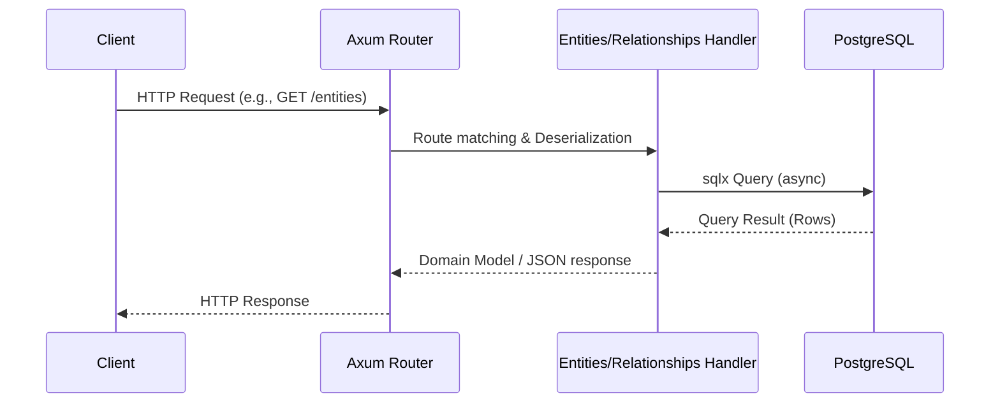

# Backend Specification

## Overview

The backend is built in Rust using the Axum framework for the web server, sqlx for asynchronous PostgreSQL database interaction, and Tokio for the asynchronous runtime.

## Core Responsibilities

1. **Entities Management**: Managing dynamic entities like services, databases, VMs, networks, and clusters.
2. **Relationships Management**: Modeling dependencies and associations between different entities.
3. **User Management**: Creating and retrieving user details.
4. **Metrics**: Serving telemetry metrics for the application.
5. **Database Interaction**: The backend communicates directly with the PostgreSQL database.

## API Structure



The backend code is primarily organized inside `backend/src/webserver`:

*   **Entities** (`entities.rs`): Contains logic and endpoints to handle entity resources (e.g., getting, listing, creating, and updating entities). These endpoints likely interface with the generic `entities` table storing dynamic types and `attributes` in JSONB.
*   **Relationships** (`relationships.rs`): Handles the connections and dependencies between different entities. Used to map out how a service consumes other services or relies on infrastructure components.
*   **Users** (`users.rs`): Endpoints for handling user-related actions.

## Configuration & Setup

*   **Config** (`config.rs`): Deals with application-level configuration, loading from environment variables or config files.
*   **Metrics** (`metrics.rs`): Responsible for providing application metrics.
*   **Main & Lib** (`main.rs`, `lib.rs`): Entry points and core library orchestration for the Axum application.
*   **Tokio Tools** (`tokio_tools.rs`): Helpers and utilities for working with the Tokio asynchronous runtime.
*   **Persistence** (`persistence`): Includes specialized handling for data serialization/deserialization, e.g., using Parquet (`parquet.rs`).

## Development

- Start backend locally with hot-reloading:
  ```bash
  make backend-dev
  ```
- Run backend tests:
  ```bash
  make backend-test
  ```
- Build docker image:
  ```bash
  make backend-docker
  ```
