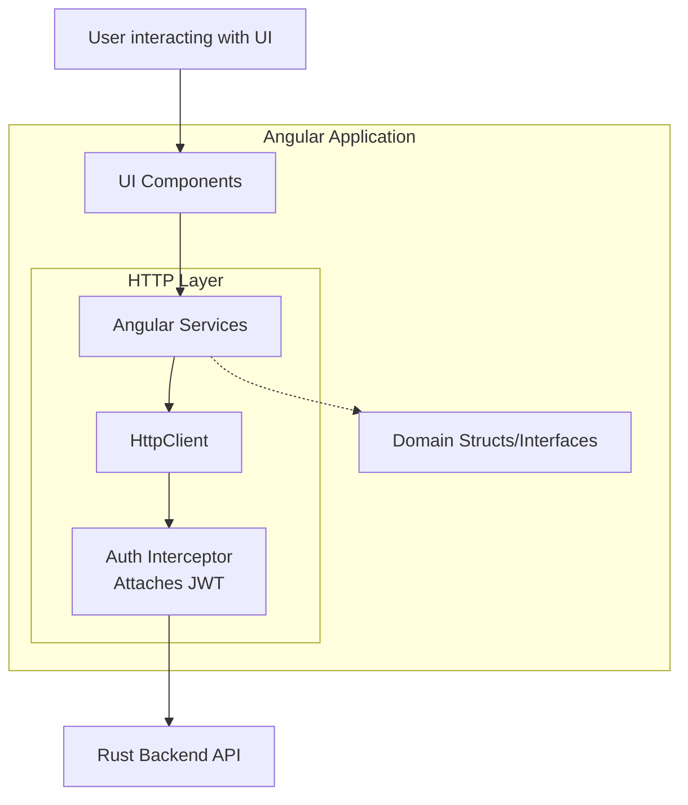

# Frontend Specification

## Overview

The frontend is a single-page application built using the Angular framework and styled with Angular Material components. It provides a visual interface for users to capture, annotate, and explore service dependencies and their related infrastructure components (VMs, Clusters, Networks).

## Architecture



*   **Framework**: Angular
*   **UI Library**: Angular Material
*   **Styling**: SCSS
*   **Authentication Library**: `angular-oauth2-oidc`

## Core Directory Structure

The main logic resides within `frontend/src/app`:

*   **Components (`components/`)**: Houses the building blocks of the UI. Expected to contain components for viewing and managing entities, viewing service dependencies, visualizing availability/SLOs, and more.
*   **Services (`services/`)**: Contains logic for data fetching, interfacing with the Rust backend over HTTP, and shared application state management.
*   **Interceptors (`interceptors/`)**: Contains HTTP interceptors. Crucially, the `auth.interceptor.ts` is responsible for attaching the JWT bearer token to outgoing requests to secure the API.
*   **Structs (`structs/`)**: Defines the TypeScript interfaces and types corresponding to the domain models (e.g., Service, Entity, Relationship).

## Configuration

*   **App Config (`app.config.ts`)**: Defines application-wide providers, module imports, and initialization logic.
*   **Routing (`app.routes.ts`)**: Defines the navigational paths and maps them to their corresponding components.
*   **Auth Config (`auth.config.ts`)**: Configures the OpenID Connect parameters (Issuer, Client ID, Redirect URIs) for `angular-oauth2-oidc`.

## Development

- Always run `npm install` inside the `frontend` directory before executing commands.
- **Start Development Server**:
  ```bash
  make frontend-dev
  ```
  *(Runs on port 4200. Alternatively, `cd frontend && ./node_modules/.bin/ng serve`)*
- **Lint**:
  ```bash
  cd frontend && ./node_modules/.bin/ng lint
  ```
- **Build Docker Image**:
  ```bash
  make frontend-docker
  ```
